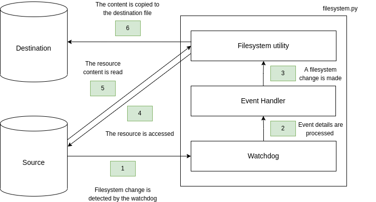

# raidify

[](https://github.com/davideolgiati/raidify/actions/workflows/python-tests.yaml)
[](https://www.codefactor.io/repository/github/davideolgiati/raidify)

python3 script to keep 2 folders synced

The project is composed by two python files, raidify.py and filesystem.py. raidify.py is the entrypoint for the 
execution, filesystem.py is the underneath logic layer through which watchdog events are handled.

### setup:

```
[davide@fedora raidify]$ pip install -r requirements.txt
[davide@fedora raidify]$ python3 raidify.py /path/to/source /path/to/dest
```
To run this program, first install all the dependency in requirements.txt using pip. Then execute the script providing 
as input the source directory and the destination directory

### business logic:
&nbsp;



